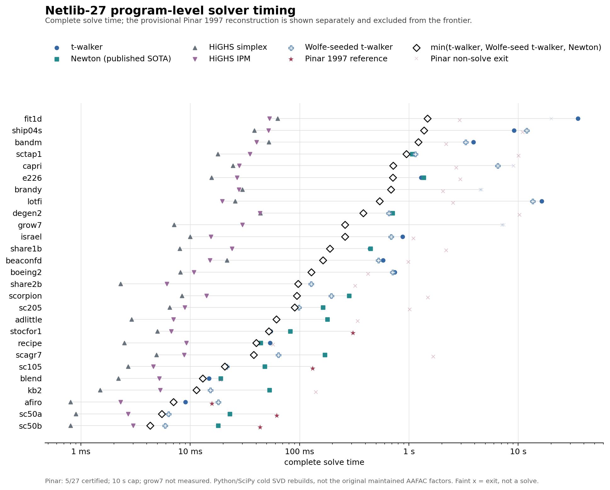

# Revisiting Exact-Penalty Linear Programming

## A projection-path walker for the regime where Newton slows down

**Public prototype - 17 August 2026**

The TeX source `paper/twalker_progress_note.tex` is now the canonical PDF
source. This Markdown copy remains the working source for a planned HTML
companion; the two versions should be reconciled before public release.

Mangasarian showed that a quadratic penalty program yields an exact LP solution
at a sufficiently large but finite penalty parameter. He used that result to
build a Newton method for LPs. Empirically, Newton excels when constraints
outnumber variables by roughly 5 to 10 and often reaches the LP solution in only
a few nonlinear iterations. But two gaps remain. Newton slows sharply below
roughly 2 to 3 constraints per variable, a regime that includes much of the
Netlib benchmark panel and arises in practical linear programs. Its stopping
tolerances can also compromise numerical accuracy. This note addresses both
gaps.

We built a complementary method, the **t-walker**, for this regime. The walker
follows the exact dual projection path from face to face instead of solving the
penalty problem afresh at a sequence of penalty values. On the tested low-ratio
problems, t-walker outpaces Newton. Choosing the faster certified result from
t-walker or Newton also improves Mangasarian's performance across Netlib. The
pair still trails HiGHS, but it measurably improves on Newton alone.

We test both raw methods against the same original-data accuracy standard, and
both pass on the problems they solve. A common simplex crossover cuts their
median Netlib error by about three orders of magnitude. After crossover, their
median errors have the same order as HiGHS IPM with crossover, although the
synthetic tails remain mixed and t-walker still has three Netlib DNFs.

On the current 24-cell synthetic panel (25, 50, and 200 variables; ratios 1.1
through 32; five interleaved runs), the fastest certified walker/Newton result
runs a median **2.82x faster than Newton alone for ratios at most 2**, with cell
speedups from 1.69x to 11.76x. Across all 24 cells, the measured lower envelope
chooses the default-seed walker 11 times, the triangular-seeded walker 6 times,
and Newton 7 times. This measured frontier uses hindsight; it does not yet
provide an automatic dispatcher.

The standard Netlib-27 panel gives a harder test. The current frontier takes
**9.60 s**, versus **11.60 s** for shipped Newton and **0.370 s** for the faster
HiGHS engine on each model. Its geometric-mean ratio to HiGHS is **16.6x**, down
from Newton's 26.5x but still far from production parity. That is progress, not
victory. HiGHS draws on roughly eighty years of simplex and interior-point ideas
and implementation practice; we assembled the walker prototype in a handful of
AI-assisted engineering sessions.

### Two computational strategies

Write the primal and dual as

`min d'x subject to Bx >= b`, and `max b'y subject to B'y = d, y >= 0`.

For the dual feasible polyhedron `D = {y >= 0 : B'y = d}`, Mangasarian's penalty
program returns exactly

`y(t) = P_D(t b)`.

The optimizer path is continuous and piecewise affine. The optimal penalty
value is piecewise quadratic, and the path direction determines its curvature.
The walker therefore follows an affine state on each face even though the
value function is quadratic there.

| method | what it maintains | why it wins | where it pays |
|---|---|---|---|
| staged Newton | a fixed-`t` semismooth solve, with staged increases in `t` and terminal polishing | crosses many support changes in a small number of iterations; excellent on tall synthetic systems | expensive identification/factor work near the low-ratio regime |
| t-walker | one affine face segment `y(t)=t g+h` and the next ratio-test event | cheap, explicit progress near the square end; the walker checks every accepted endpoint | pays for every breakpoint; long paths dominate tall and difficult models |
| triangular-seeded t-walker | the same walk, but a QR/triangular fixed-`t=0` projection seed | can make initialization and the first face cheaper | presently requires full column rank and fails closed on some cells |
| HiGHS simplex/IPM | mature production bases, pricing, presolve, scaling, and crossover | robust reference performance and coverage | a different engineering scale; we use it as the benchmark, not as our contribution |

<!-- PAGE 2 -->

## How the walker advances

On a face with positive dual support `W`, the projection equations reduce to

`y_W(t) = t g + h`.

Each active coordinate `y_i(t)` must remain nonnegative. Each inactive
coordinate has an affine multiplier margin that must also remain nonnegative.
The walker finds the next breakpoint with a minimum-ratio test over these
margins. At a tie, it exchanges rows at fixed `t` to resolve degeneracy; those
exchanges do not count as progress. A valid next segment must reach a strictly
larger `t` or prove that the path is terminal. Within a face, the penalty
curvature is `phi''(t)=g'g`. The terminal test `g'g <= tolerance` therefore
serves as both a geometric stopping rule and the zero-curvature test.

We made the implementation faster and more stable by treating the walker state
like a numerical simplex state. The solver now carries the face coefficients,
sparse products, support statuses, and a rank-revealing square core across
pivots instead of solving unrelated least-squares problems at each one. A
one-row change updates that state. The solver fully reconstructs it only after a
failed error bound, a rank change, or a rare repair. We made six main changes:

1. native C++ face algebra and cached affine artifacts instead of default
   library calls at every pivot;
2. a stable square orthogonal core, with a small weak-subspace SVD/COD repair
   when the face is rank deficient;
3. deterministic statuses for dependent zero rows, so fixed-`t` exchanges
   cannot cycle merely by revisiting an equivalent support label;
4. iterative refinement and forward-horizon error bounds that the walker
   invokes only when coefficient uncertainty can change the next event;
5. fixed-`t` seed and endpoint repairs that feed the unchanged original-data
   acceptance gate; and
6. a final primal-dual certificate, independent of `t`, on the unscaled input.

The prototype remains hybrid. By default, an in-process Newton method builds
the walker's `t=0` seed. An optional triangular/Wolfe-space seed instead factors
`B` and solves the same fixed-`t` projection without forming a dense null-space
basis. On difficult Netlib faces, the walker can also invoke HiGHS-backed
endpoint selection or terminal face repair. We count these calls toward walker
time, and every result must pass the original-data certificate. The benchmark
therefore does not yet isolate wholly native path algebra.

**Figure 1.** Complete time above and post-initialization kernel time below.
The black line shows the fastest certified default-seed walker,
triangular-seeded walker, or Newton result. The measured axis starts at 1.1;
we retain 1.0 only as a reference. The generator changes aspect ratio and
planted support geometry together, so the plot establishes a useful regime,
not a theorem that aspect ratio alone is causal.

<!-- PAGE 3 -->

## Accuracy, coverage, and what remains

Solver status strings do not measure accuracy on a common scale. We therefore
reevaluated every available primal-dual pair on the original inequality form
with one componentwise backward-error certificate. The score is the largest
of four normalized errors: primal infeasibility, dual equality, violation of
`y >= 0`, and the primal-dual gap. The acceptance tolerance is `1e-7`. DNF and
resource-limit cases count as coverage failures, not zero-error samples.

For t-walker and Newton, we send each solver's dual point to the same warm-started
HiGHS simplex postprocessor and then apply the same original-data certificate.
We do not pass t-walker's retained basis. This procedure gives us a portable
common crossover, not the proposed native basis route.

**Figure 2.** Each dot represents one problem under the same original-data
certificate; diamonds mark medians, and the labels at right show coverage.
Common crossover cuts the Netlib median error by about three orders for both
methods. The synthetic results are mixed: t-walker's median improves but its
tail widens, while Newton's median and tail worsen but remain inside tolerance.
HiGHS IPM crossover restores one failed certificate in each suite. Crossover
cannot repair a DNF because a DNF supplies no terminal point.

These results do not show that a new LP solver beats HiGHS. They show that
Newton and the walker cover different regimes. On the controlled family,
Newton has a reproducible weak band that the walker fills. On Netlib, their
measured Pareto frontier saves about 2.0 seconds over Newton alone. The pair
still trails mature solvers by more than an order of magnitude and does not
certify every model.

Three problems remain. First, turn the hindsight frontier into a dispatcher
that uses observed geometry - rank, weak singular values, and identification
margin - rather than aspect ratio alone. Second, replace the remaining HiGHS
face selectors with the maintained basis and bounded native repairs. Third,
close the three-program coverage gap without slowing the cheap branch. The
walker now covers part of the left-hand synthetic gap, and we measure the
remaining benchmark deficit under one accuracy standard.

<!-- PAGE 4 -->

## Related work and a provisional Pinar check

The projection path itself is classical. Mangasarian and Meyer established
finite exactness for nonlinear LP perturbations in 1979, and Mangasarian later
characterized least-norm LP solutions by projection. Madsen, Nielsen, and
Pinar developed finite continuation methods on piecewise-linear paths. Most
directly, Pinar's 1997 algorithm follows a quadratic-penalty path with
predictor steps, modified-Newton correction, retained factor updates, and
iterative refinement. This work predates Mangasarian's 2002 Newton report.

After dualization and the change of parameter `T = 1/tau`, Pinar's perturbed
optimizer is exactly `P_D(T b)`, the path used here. The distinction is
algorithmic. Pinar evaluates selected penalty values with predictor and
corrector steps; t-walker attempts to visit the next certified breakpoint.
General parametric-QP active-set methods already supply the larger setting for
piecewise-affine optimizer maps, ratio events, dependent-constraint exchanges,
and factor updates. We therefore do not claim a new path or homotopy principle.

**Figure 3.** Complete Netlib-27 solve time. Stars mark the four certified
Pinar results; faint crosses mark measured exits, not solves. Pinar is shown
for comparison but is excluded from the black Mangasarian frontier.

We built a correctness-first reconstruction of Pinar's algorithm and ran it on
the same canonical Netlib panel with one thread and a 10-second cap. It called
neither t-walker nor an LP solver. It certified `afiro`, `sc50a`, `sc50b`, and
`sc105`; 19 models stopped at a numerical gate, three reached the time limit,
and `grow7` was not measured because its canonical fixture was missing. The
four complete Python/SciPy times ranged from 19.9 to 117.9 ms.

These timings are directional, not a reproduction of Pinar's Fortran costs.
For smaller models, our code rebuilds a cold rank-revealing SVD at every Newton
and path solve; larger models use sparse LSMR. Pinar maintained and updated
AAFAC factors, and his paper reports successful runs on its ten-model panel.
One possible reading of our failures is that a geometric predictor and
corrector may still need an explicit combinatorial basis/status policy at
degenerate breakpoints. That is a hunch to test, not a conclusion from 4/27.

### Sources and protocol

Mangasarian, "A Newton method for linear programming," *JOTA* 121 (2002),
1-18; Mangasarian and Meyer, "Nonlinear perturbation of linear programs,"
*SICON* 17 (1979), 745-752; Pinar, "Piecewise-linear pathways to the optimal
solution set in linear programming," *JOTA* 93 (1997), 619-634; Huangfu and
Hall, "Parallelizing the dual revised simplex method," *MPC* 10 (2018),
119-142. One thread; HiGHS presolve off; IPM uses both crossover settings. We
report five interleaved runs for raw synthetic values and one deterministic
warm-point run per problem for crossover accuracy. The Netlib panel combines
frozen records, so read its times at order-of-magnitude precision.
Reproduce accuracy with
`experiments/bench_common_accuracy.py`; figures with
`experiments/render_solver_timing_charts.py` and
`experiments/render_common_accuracy.py`. Reproduce the provisional Pinar panel
with `experiments/pinar1997/run_netlib_panel.py` and
`experiments/pinar1997/render_provisional_netlib.py`.
